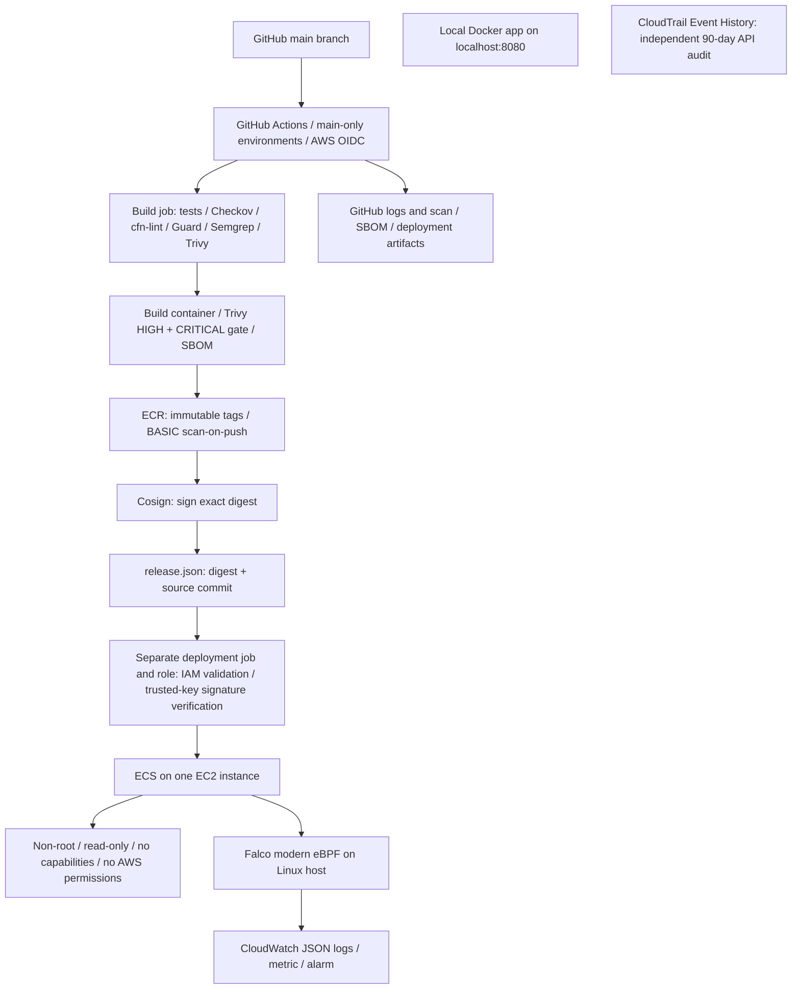

# AWS DevSecOps student implementation

A small application and a complete AWS deployment scaffold for Problem Statement 10. GitHub repository: [MAvinash24/aws](https://github.com/MAvinash24/aws). Region: Mumbai (`ap-south-1`).

**Active deployment:** GitHub Actions runs scans, builds, digest signing and signature-verified ECS deployment. AWS hosts ECR, ECS, Falco, signing parameters and CloudWatch. GitHub uses short-lived OIDC credentials with separate bounded build/deploy roles. The legacy CodeBuild pipeline is disabled because its account quota is zero. See [validation evidence](docs/validation.md) for actual run results and [PowerShell commands](docs/LOCAL-RUN-POWERSHELL.md) for the independent local app.

## Architecture



AWS resources can incur charges. Open-source security tools remove product subscriptions and trials; they do not make EC2, public IPv4, EBS, S3, ECR, builds, or logs unconditionally free. Confirm your account's eligibility, credit balance and billing limits before provisioning. No NAT gateway, load balancer, EKS cluster, customer-managed KMS key, Inspector, GuardDuty, Security Hub, Config recorder or Control Tower landing zone is created.

## Files

| Location | Purpose |
|---|---|
| `app/`, `Dockerfile` | Dependency-free HTTP demo, `/health`, non-root container, digest-pinned base |
| `infra/platform.json` | ECR, artifact bucket, logs, IAM boundary and runtime roles, alerting |
| `infra/runtime.json` | Existing VPC/subnet, one encrypted EC2 ECS host, Falco, zero-count bootstrap service |
| `.github/workflows/deploy.yml` | Active GitHub Actions scan/build/sign and separate verify/deploy jobs |
| `infra/github.json` | AWS OIDC provider and separate bounded GitHub roles |
| `infra/pipeline.json` | Retained legacy CodePipeline/CodeBuild infrastructure; push detection disabled |
| `infra/generate.py` | Editable source for all four templates; regenerate after changing it |
| `security/` | Guard rules and rejection fixtures, Semgrep rules, Checkov scope, version/checksum locks |
| `scripts/` | Scan, build, sign, verify/deploy, provisioning, drift and stop/resume commands |
| `docs/github-actions.md` | Active CI setup, trust, running and troubleshooting |
| `docs/deployment.md` | AWS stack setup and legacy pipeline reference |
| `docs/LOCAL-RUN-POWERSHELL.md` | Copyable local Python/Docker/scan commands |
| `docs/trust-and-costs.md` | Trust boundary, substitutions, limits and billing considerations |

## Run locally (PowerShell)

```powershell
Set-Location D:\aws
python -m unittest discover -s tests -v
python scripts/check-project.py
python -m app.server
```

Open [the local health check](http://127.0.0.1:8080/health). Stop the server with Ctrl+C. This demonstrates application behavior, not an AWS deployment.

With Docker Desktop running and `docker` on your PATH:

```powershell
.\scripts\validate-local.ps1
docker run --rm -p 127.0.0.1:8080:8080 --read-only --cap-drop ALL --security-opt no-new-privileges devsecops-app:local
```

The PowerShell helper runs scans on the container's Linux filesystem to avoid slow Windows file traversal, builds the app, and scans the saved image. It exits on any gate failure. On Linux/CodeBuild, image scanning uses the local Docker image directly:

```bash
trivy image --scanners vuln,secret --severity HIGH,CRITICAL --exit-code 1 devsecops-app:local
```

Never add `--ignore-unfixed`, `|| true`, or `--exit-code 0` to get a passing demonstration. A new HIGH/CRITICAL finding must fail the gate even when the base image currently has no vendor fix.

## Deploy

Follow [GitHub Actions instructions](docs/github-actions.md). Push application, infrastructure or pipeline changes to `main`, or select **Run workflow** in GitHub Actions. Documentation-only pushes do not deploy. CodeBuild capacity is not required. Production runs are serialized and use GitHub environments restricted to `main`.

The deployment job validates IAM policies, verifies the trusted-key signature for the exact repository digest, and checks task hardening before changing ECS. It downloads only its own run's release artifact and checks the exact source commit. The build role cannot deploy; the deploy role cannot sign or push images. Local tests check rejection and rollback behavior. The initial bootstrap release used the same verifier from the administrator's local setup session.

## Assignment substitutions

| Assignment service | Implemented demonstration | Important difference |
|---|---|---|
| CodeGuru Reviewer | Semgrep CE with checked-in rules | Static patterns; no CodeGuru ML/concurrency parity |
| Inspector | Trivy filesystem and image gates + ECR BASIC scan | CI snapshot; no managed continuous vulnerability service |
| AWS Signer | Cosign keyed signing in ECR OCI reference artifacts | Independent signing system; trust and key management are yours |
| Control Tower/SCPs | Scoped roles + IAM boundaries + Access Analyzer + Guard | Single account; boundaries are not organization-wide SCPs |
| GuardDuty runtime | Falco modern eBPF | Host/container detection; no managed account threat intelligence |
| Security Hub | CloudWatch log/metric/alarm + native EventBridge pipeline events | Monitoring, not a centralized CSPM finding service |
| AWS Config | Guard prevention + on-demand CloudFormation drift script | Not continuous compliance; only supported resource properties |

These substitutions preserve the proposed project demonstration goals. They do **not** satisfy a rubric requiring those exact managed products; obtain your instructor's agreement to the replacements.
